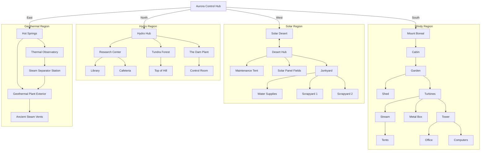
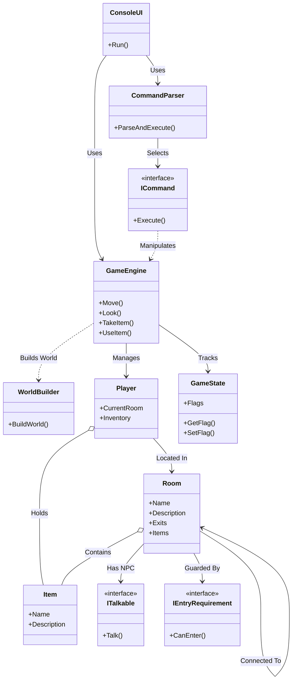

# Project Aurora - Console Text Adventure

An open-source, console-based text-adventure where you play an engineer trying to restore power across four regions: Solar Desert, Hydro Hub, Windy Highlands, and Volcanic Plains.

## 1. Overview
Project Aurora is a text-based adventure game where the player acts as an engineer in the year 2075. The goal is to restore power to four regions: Solar Desert, Hydro Hub, Windy Highlands, and Volcanic Plains. The game runs in a console environment and uses a natural language parser for user input.

## 2. Global Mechanics

### 2.1 Input Parser
*   **Format**: The game accepts one or two-word commands (e.g., "north", "take key").
*   **Case Sensitivity**: All inputs are converted to lowercase/handled case-insensitively.
*   **Invalid Commands**: If a command is not recognized, the game prints "I don't know that command."
*   **Supported Commands**: `go`, `move`, `north`, `south`, `east`, `west`, `up`, `down`, `look`, `take`, `use`, `inventory` (or `inv`, `i`), `talk`, `help`, `map`.

### 2.2 Inventory System
The game uses a list-based inventory system to track items the player has collected.
*   **Taking Items**: `take [item name]` adds the item to the player's inventory and removes it from the room.
*   **Checking Inventory**: `inventory`, `inv`, or `i` lists all items currently held by the player.
*   **Using Items**: `use [item name]` triggers specific events if the player is in the correct room and has the item in their inventory.

### 2.3 Navigation
*   **Movement**: `north`, `south`, `east`, `west`, `up`, `down`.
    * When you move using a navigation command, the game now automatically prints the room description.
*   **Look**: `look` still prints the current room's long description (including exits and items) on demand.

### 2.4 NPC State Logic
*   **Cyclic Dialogue**: NPCs repeat their primary hint or instruction until a specific game state changes (e.g., an item is received or a task is completed).
*   **State-Dependent Dialogue**: After a quest is completed (e.g., `talkedToLiora = true`), the NPC's dialogue changes to reflect progress (e.g., "Good luck with the panels!").

### 2.5 Game Loop & UI Specifics
*   **Screen Clearing**: The console clears (`Console.Clear()`) upon moving to a new room to keep the interface clean.
*   **Color Coding**:
    *   **Room Names**: Magenta
    *   **Items**: Cyan
    *   **NPCs**: Green
    *   **Exits**: Yellow
    *   **Error Messages**: Red

### 2.6 Win/Loss State Definitions
*   **Victory**: The game ends when all four regions are restored and the player returns to the Aurora Control Hub. This requires completing the Solar Desert, Hydro Hub, Windy Highlands, and Volcanic Plains regions.
*   **Game Over / Setbacks**:
    *   **QTE Failure**: Failing the Hydro QTE results in a 10-second timeout before retrying. There is no permanent "Game Over" screen.
    *   **Quiz Failure**: Answering incorrectly in the Solar Desert quiz moves the player back to the previous room, requiring them to try again. The Geothermal quiz requires 2 out of 3 correct answers to pass; incorrect answers can be retried.

## 3. Region Specifications

### 3.0 World Map

#### World Map Diagram



#### Detailed Region Connections

**Solar Desert (West):**
- Solar Desert ↔ Desert Hub ↔ Maintenance Tent
- Desert Hub → Solar Panel Fields (north)
- Desert Hub → Junkyard (south, requires Desert Key)
- Junkyard branches to: Water Supplies, Scrapyard 1, Scrapyard 2

**Hydro Hub (North):**
- Hydro Hub ↔ The Dam Plant → Control Room (requires key)
- Hydro Hub ↔ Research Center ↔ Library / Cafeteria
- Hydro Hub ↔ Tundra Forest → Top of Hill

**Windy Highlands (South):**
- Mount Boreal → Cabin ↔ Garden
- Garden → Shed (north, requires Shed Key) / Turbines (south)
- Turbines branches to: Tower, Metal Box, Stream
- Tower → Office / Computers
- Stream → Tents

**Geothermal/Volcanic Plains (East):**
- Hot Springs ↔ Thermal Observatory ↔ Steam Separator Station
- Hot Springs ↔ Geothermal Plant Exterior ↔ Steam Separator Station
- Geothermal Plant Exterior → Ancient Steam Vents

#### In-Game ASCII Map

The game features an in-game map command that displays your current location:

```
+---------------------------------------------------------------------------------------------+
|                                   PROJECT AURORA MAP                                        |
+---------------------------------------------------------------------------------------------+
|                                                                                             |
|                                            [LIBRY ]                                         |
|                                               |                                             |
|                                            [REARCH]---[ CAFE ]                              |
|                                               |                                             |
|                           [ HILL ]            |          [CNTRL ]                           |
|                              |                |             |                               |
|                           [TUNDRA]---------[H.HUB ]------[ DAM  ]                           |
|                                               |                                             |
|                                               |                                             |
|                 [S.FLD ]                      |                      [VENTS ]               |
|                    |                          |                         |                   |
|    [ TENT ]-----[D.HUB ]--[SOLAR ]---------[ HUB  ]----[H.SPRG]------[PLANT ]               |
|                    |                          |           |             |                   |
|       [WATER ]--[ JUNK ]--[SCRP 2]            |        [OBSRVY]------[SEPRAT]               |
|                    |                          |                                             |
|                 [SCRP 1]                      |                                             |
|                                               |                                             |
|                                            [BOREAL]         [ SHED ]                        |
|                                               |                |                            |
|                                            [CABIN ]---------[GARDEN]                        |
|                                                                |                            |
|                                                                |                            |
|                                       [TENTS ]                 |        [COMPRS]            |
|                                          |                     |           |                |
|                                       [STREAM]--------------[TURBIN]----[TOWER ]--[OFFICE]  |
|                                                                |                            |
|                                                             [M.BOX ]                        |
|                                                                                             |
+---------------------------------------------------------------------------------------------+
```

**Map Legend:**
- Your current location is highlighted in RED when using the in-game `map` command
- Use cardinal directions (north, south, east, west) to navigate
- Some connections require specific items or completing quests

---

## Getting Started

Prerequisites:
- .NET 9.0 SDK (or later)

Build and run:

```powershell
dotnet build
dotnet run --project ProjectAurora/ProjectAurora.csproj
```

Run unit tests:

```powershell
dotnet test
```

## License

Project Aurora is available under the MIT License. See the `LICENSE` file in the root of this repository.

---

## Map Characters & Unicode

The in-game map uses Unicode box-drawing characters for the best visual appearance in modern terminals. If you notice the map rendering incorrectly, try the following:

- Use a Unicode-capable font (e.g., Consolas, Fira Code, or DejaVu Sans Mono).
- Make sure the terminal encoding is set to UTF-8.
- If you prefer plain ASCII, update the `mapTemplate` in `ProjectAurora/Domain/GameEngine.cs` with an ASCII version.


### 3.1 Hub: Aurora Control Hub
*   **Description**: The starting point.
*   **Exits**:
    *   `north` -> Hydro Hub
    *   `west` -> Solar Desert
    *   `south` -> Mount Boreal (Windy Highlands)
    *   `east` -> Hot Springs (Geothermal Plains)

---

### 3.2 Region 1: Solar Desert (West)

#### Room Map
1.  **Solar Desert** (Entry)
    *   `west` -> Desert Hub
2.  **Desert Hub**
    *   `east` -> Solar Desert
    *   `west` -> Maintenance Tent (Only after talking to NPC)
    *   `north` -> Solar Panel Fields (Only after talking to NPC)
    *   `south` -> Junkyard (Requires **Desert Key**)
    *   **NPC**: Dr. Liora Sunvale.
        *   Action: `talk` sets `talkedToLiora = true`, unlocking West and North exits.
3.  **Maintenance Tent**
    *   `east` -> Desert Hub
    *   **Event**: Attempting to enter triggers a quiz (if not already completed).
        *   Question: "What happens if solar panels overheat?"
        *   Options: (1) More energy, (2) Less efficiency, (3) Catch fire.
        *   Input `2`: Success. Player enters the tent.
        *   Input `1` or `3`: Failure. Entry denied, player remains in Desert Hub.
    *   **Item**: **Desert Key** - Must be taken manually using `take Desert Key`.
4.  **Junkyard**
    *   `north` -> Desert Hub
    *   `west` -> Water Supplies
    *   `south` -> Scrapyard 1
    *   `east` -> Scrapyard 2
    *   **Entry Requirement**: Requires **Desert Key**. The key is consumed on first entry and the door remains unlocked permanently.
5.  **Water Supplies**
    *   `east` -> Junkyard
    *   **Item**: **Water Hose** - Visible in the room, must be taken manually using `take Water Hose`.
6.  **Scrapyard 1**
    *   `north` -> Junkyard
    *   **Item**: **Robotic Parts 1** - Visible in the room, must be taken manually.
7.  **Scrapyard 2**
    *   `west` -> Junkyard
    *   **Item**: **Robotic Parts 2** - Visible in the room, must be taken manually.
8.  **Solar Panel Fields**
    *   **Event**: Upon entry, the player is presented with a choice of repair methods.
        *   **Method 1**: `use water hose`
            *   Condition: Requires **Water Hose** in inventory.
            *   Outcome: "Temporary fix". Game prints success message. Player returned to **Aurora Control Hub**.
        *   **Method 2**: `use robotic parts 1` (or `use robotic parts 2`)
            *   Condition: Requires **Robotic Parts 1** AND **Robotic Parts 2** in inventory.
            *   Outcome: "Saved the Solar Desert". Game prints success message. Player returned to **Aurora Control Hub**.

---

### 3.3 Region 2: Hydro Hub (North)

#### Room Map
1.  **Hydro Hub** (Entry)
    *   `south` -> Aurora Control Hub
    *   `east` -> The Dam Plant
    *   `north` -> Research Center
    *   `west` -> Tundra Forest
2.  **Research Center**
    *   `south` -> Hydro Hub
    *   `north` (or `up`) -> Library
    *   `east` -> Cafeteria
3.  **Library**
    *   `south` (or `down`) -> Research Center
    *   **NPC**: Dr. Amara Riversong. Dialog provides hints about the acid (berries + pinecone).
4.  **Cafeteria**
    *   `west` -> Research Center
    *   **Item**: `key` (Dam Key).
        *   Action: `take key` -> Adds 'key' to inventory.
5.  **Tundra Forest**
    *   `east` -> Hydro Hub
    *   `north` -> Top of the Hill
    *   **Description**: "You have entered the Tundra Forest. Towering trees extend in every direction. On the ground you notice a few pinecones and a nearby bush with ripe berries. Be careful wandering — it's easy to get lost here."
    *   **Item**: `berries`.
        *   Action: `take berries` -> Adds 'berries' to inventory.
    *   **Item**: `pinecone`.
        *   Action: `take pinecone` -> Adds 'pinecone' to inventory.
6.  **Top of the Hill**
    *   `south` -> Tundra Forest
    *   **Item**: `lever`.
        *   Action: `take lever` -> Adds 'lever' to inventory.
7.  **The Dam Plant**
    *   `west` -> Hydro Hub
    *   `north` -> Control Room
        *   **Condition**: Requires **Dam Key** in inventory. If false, prints "Entrance sealed".
8.  **Control Room**
    *   `south` -> The Dam Plant
    *   **Interaction**:
        *   `use lever`:
            *   Condition: Requires **lever** in inventory.
            *   Outcome: Sets `leverRepaired = true`. Prints success message.
        *   `use berries` (or `use pinecone`):
            *   Condition: Requires **berries** AND **pinecone** in inventory.
            *   Outcome: Triggers **QTE Minigame** (if lever not repaired) or fixes dam (if lever repaired).

#### QTE Minigame (Hydro)
*   **Trigger**: Using berries/pinecone in Control Room without repairing the lever.
*   **Mechanic**:
    *   The game displays a random key from: `A, S, D, J, K, L`.
    *   The player has **3000ms (3 seconds)** to press the correct key.
    *   This repeats **5 times**.
*   **Win Condition**: 5 successful presses.
    *   Result: "Hydroelectric Dam back to full power". Sets `qteComplete = true`.
*   **Fail Condition**: Pressing wrong key or timeout.
    *   Result: "Failure". Must wait 10 seconds (simulated by `Thread.Sleep`) before retrying.
*   **Alternative Win**: If `leverRepaired` is true, the QTE is skipped and the dam is fixed instantly.

---

### 3.4 Region 3: Windy Highlands (South)

#### Room Map
1.  **Mount Boreal** (Entry)
    *   `north` -> Aurora Control Hub
    *   `south` -> Cabin
2.  **Cabin**
    *   `north` -> Mount Boreal
    *   `east` -> Garden
    *   **Item**: `snack`.
        *   Action: `take snack` -> Adds 'snack' to inventory.
3.  **Garden**
    *   `north` -> Shed
    *   `south` -> Turbines
    *   `west` -> Cabin
    *   **Item**: `code`.
        *   Condition: Only appears/takable if `box` flag is true (visited Metal Box).
        *   Action: `take code` -> Adds 'code' to inventory.
4.  **Shed**
    *   `south` -> Garden
    *   **Lock Condition**: Requires **Shed Key** in inventory to enter. The key is consumed on entry.
    *   **Item**: `note` (Hint Note). `take note` -> Adds 'note' to inventory.
    *   **Item**: `power cables`. `take power cables` -> Adds 'power cables' to inventory.
5.  **Turbines**
    *   `north` -> Garden
    *   `east` -> Tower
    *   `south` -> Metal Box
    *   `west` -> Stream
    *   **NPC**: Turbines Operator.
        *   Action: `talk`. Provides information about the turbines.
6.  **Stream**
    *   `north` -> Tents
    *   `east` -> Turbines
7.  **Tents**
    *   `south` -> Stream
    *   **NPC**: Raccoon.
    *   **Interaction**: `use snack`.
        *   Condition: Requires **snack** in inventory.
        *   Outcome: Sets `fedRaccoon = true`. Raccoon drops **control board** in the **Tents** room.
    *   **Item**: `control board`.
        *   Action: `take control board`.
        *   Condition: Appears after feeding the raccoon.
8.  **Metal Box**
    *   `north` -> Turbines
    *   **Event**: Entering sets `box = true` (allows finding code in Garden).
    *   **Item**: `anemometer`.
        *   Condition: Requires **code** in inventory.
        *   Action: `use code`. Game prompts for the passcode (Answer: "Rigby").
        *   Outcome: Box opens, revealing **anemometer**. Use `take anemometer` to collect it.
9.  **Tower**
    *   `north` -> Computers
    *   `east` -> Office
    *   `south` -> Turbines
    *   **Item**: `flimsy cables`.
        *   Condition: Can be taken if **Shed Key** is in inventory (hidden item).
        *   Action: `take flimsy cables` -> Adds 'flimsy cables' to inventory.
10. **Office**
    *   `west` -> Tower
    *   **NPC**: Prof. Kael Stormwright.
    *   **Interaction**: `talk`.
        *   If **anemometer** AND **control board** AND **power cables** in inventory: Sets `step1 = true`. (Good Ending path).
        *   If **anemometer** AND **control board** AND **flimsy cables** in inventory (and NO power cables): Dialog about flimsy cables.
        *   If missing items: Gives **Shed Key** (Adds 'Shed Key' to inventory).
11. **Computers**
    *   `south` -> Tower
    *   **NPC**: Computers Terminal.
    *   **Interaction**: `talk`.
        *   Condition: Requires `step1 = true`.
        *   Outcome: Sets `step2 = true`.
        *   Consequence: When returning to Turbines and talking to Prof. Kael again, player is returned to Aurora Control Hub and Windy Region is marked as restored.

---

### 3.5 Region 4: Volcanic Plains / Geothermal (East)

The fourth region features geothermal energy, accessed from Aurora Control Hub by going east. This region teaches players about renewable geothermal power generation.

#### Room Map
1.  **Hot Springs** (Entry)
    *   `west` -> Aurora Control Hub
    *   `south` -> Thermal Observatory
    *   `east` -> Geothermal Plant Exterior
    *   **NPC**: Kenji
        *   Action: `talk`. Discusses the balance between natural springs and geothermal power generation.
    *   **Description**: "The natural hot springs steam gently. You see paths to a monitoring station (south) and a large plant facility (east)."
2.  **Thermal Observatory**
    *   `north` -> Hot Springs
    *   `east` -> Steam Separator Station
    *   **NPC**: Dr. Elena Voss
        *   **Dialogue 1** (Before submitting thermal data): Asks player to collect thermal data from the Steam Vents to help research.
        *   **Dialogue 2** (After submitting thermal data): Congratulates player and confirms data shows the reservoir can provide sustainable energy for decades.
    *   **Interaction**: `use thermal data`
        *   Condition: Requires **thermal data** in inventory.
        *   Outcome: Sets `thermalDataSubmitted = true`. Player must then obtain a **permit** and use it here for the geothermal certification quiz.
    *   **Interaction**: `use permit`
        *   Condition 1: Requires **permit** in inventory.
        *   Condition 2: Requires `thermalDataSubmitted = true` (must have already submitted thermal data).
        *   Outcome: Triggers **Geothermal Certification Quiz**. On passing (2 out of 3 correct), sets `geothermalCertified = true` and awards **geothermal_certificate**. On failure, player can retry.
3.  **Steam Separator Station**
    *   `west` -> Thermal Observatory
    *   `north` -> Geothermal Plant Exterior
    *   **NPC**: James
        *   Action: `talk`. Explains the separator's role in the system: extracting steam, generating power, and reinjecting water to maintain the reservoir.
4.  **Geothermal Plant Exterior**
    *   `west` -> Hot Springs
    *   `south` -> Steam Separator Station
    *   `north` -> Ancient Steam Vents
    *   **NPC**: Chief Engineer Rodriguez
        *   **Interaction**: `talk`
        *   **Dialogue 1** (First time): Welcomes player, explains the plant generates 50 megawatts constantly, and places a **permit** on the ground for the player to take. This is needed to take the geothermal certification quiz.
        *   **Dialogue 2** (Subsequent times): Discusses the complete cycle of geothermal energy (natural heat, monitoring, processing, generation).
        *   **Item Added on First Talk**: **permit** - Required to take the geothermal quiz at the observatory.
5.  **Ancient Steam Vents**
    *   `south` -> Geothermal Plant Exterior
    *   **Item**: `thermal data`
        *   **Special Mechanic**: `take thermal data`
        *   Condition: Item must be taken from this location.
        *   Outcome: Sets `hasThermalData = true`, adds **thermal data** to inventory, and prints "You collect thermal data. Readings show 180°C at 2km depth."
        *   **Note**: The item can only be taken once. Attempting to take it again prints "There is no thermal data to take here."
    *   **Description**: "Steam geysers erupt over mineral-rich fractures. Try taking the thermal data."

#### Geothermal Certification Quiz
*   **Trigger**: Using the **permit** item in the Thermal Observatory, but only after submitting **thermal data**.
*   **Questions & Answers** (3 questions):
    1. "What is the main advantage of geothermal energy over solar and wind?"
       * Options: (1) Cheaper to build, (2) **Provides constant 24/7 power**, (3) Uses less land, (4) Easier to maintain
    2. "What happens to the water after it's used in a geothermal plant?"
       * Options: (1) Released into rivers, (2) **Reinjected back underground**, (3) Evaporated completely, (4) Stored in tanks
    3. "At what depth do geothermal plants typically access hot water?"
       * Options: (1) 100-500 meters, (2) **1-3 kilometers**, (3) 5-10 kilometers, (4) 20+ kilometers
*   **Pass Threshold**: 2 out of 3 correct answers required.
*   **Win Condition**: Player answers 2+ questions correctly.
    *   Result: "Congratulations! You answered [X] out of 3 correctly and earned your Geothermal Certificate!"
    *   Sets `geothermalCertified = true`.
    *   Player receives **geothermal_certificate** item.
*   **Fail/Retry Condition**: Player answers fewer than 2 correctly.
    *   Result: "You only answered [X] out of 3 correctly. You need at least 2. Try again!"
    *   Player can retry immediately by using the permit again.

---

### 4.1 Three-Layer Architecture
The project follows a strict separation of concerns using a 3-layer architecture:

1.  **Presentation Layer (UI)**
    *   **Responsibility**: Handles all user input and console output.
    *   **Principles**:
        *   The UI layer should only be responsible for displaying information to the user and capturing raw input.
        *   It should not contain any game logic or state management.
        *   Input parsing should convert raw text into structured data before passing it to the logic layer.

2.  **Business Logic Layer (Domain)**
    *   **Responsibility**: Executes game rules, processes commands, and manages game flow.
    *   **Principles**:
        *   This layer contains the core mechanics of the game (navigation, interaction, combat, etc.).
        *   It coordinates interactions between the player and the game world.
        *   It should be independent of the specific UI implementation.

3.  **Data Layer (State & Persistence)**
    *   **Responsibility**: Stores the current state of the world, player inventory, and static game data.
    *   **Principles**:
        *   This layer encapsulates all mutable state (player location, inventory, world flags).
        *   It provides a clean interface for the logic layer to query and modify state.
        *   It separates the "save data" from the runtime logic.

### 4.2 OOP Principles
The design emphasizes the following Object-Oriented principles:

*   **Encapsulation**:
    *   Game state is not global. State is encapsulated within `GameState` for global flags and within relevant room/NPC objects for local state.
    *   Objects manage their own internal state and expose methods to modify it, rather than allowing direct external modification.
    *   `Room` and `NPC` objects encapsulate behavior specific to that location or character.

*   **Polymorphism (Command Pattern & Interface-Based Design)**:
    *   Commands are executed through the `CommandParser`, which delegates to the `GameEngine` rather than containing massive switch statements.
    *   Rooms inherit from the `Room` base class and override `OnEntryEvent()`, `OnUseItem()`, and `OnTakeItem()` methods to provide region-specific logic.
    *   NPCs implement the `ITalkable` interface to standardize dialogue interactions.
    *   Items can be of different types (e.g., `KeyItem`, `RepairItem`, `ConsumableItem`) using inheritance and polymorphism.
    *   Quizzes implement `IMultiQuestionQuiz` and `IQte` interfaces to allow different game mechanics (QTE, quizzes) to be swapped or extended.

*   **Single Responsibility Principle (SRP)**:
    *   `CommandParser` only parses text input into command tokens; it doesn't execute logic.
    *   `GameEngine` orchestrates logic but delegates to rooms and NPCs for context-specific behavior.
    *   `Room` objects hold data about location state and handle entry/interaction logic for that location.
    *   `ConsoleUI` only handles user input and output display; it does not contain game logic.
    *   `Player` manages inventory and position; it doesn't make decisions about world rules.

*   **Dependency Injection & Composition**:
    *   The `GameEngine` accepts an `IWorldBuilder` interface, allowing different world implementations without coupling to a specific builder.
    *   Delegates (callbacks) in `GameEngine` for QTE and quiz systems allow the UI layer to provide interaction without hardcoding dependencies.
    *   `Room` objects are composed with optional `Occupant` (NPC) and `EntryRequirement` objects, allowing flexible configuration.

### 4.3 Class Diagram



## 5. Data & State Management

### 5.1 Domain State Models
To support the architecture, state is distributed to relevant objects:

#### GameState
A centralized state manager that holds all global game flags as a dictionary. Each flag represents a quest milestone or region completion state.

*   **Solar Region**: `talkedToLiora`, `quizCompleted`, `solarFixed`
*   **Hydro Region**: `leverRepaired`, `qteComplete`
*   **Windy Region**: `boxVisited`, `fedRaccoon`, `step1Complete`, `step2Complete`, `windyRestored`
*   **Geothermal Region**: `talkedToRodriguez`, `hasThermalData`, `thermalDataSubmitted`, `geothermalCertified`

#### Room State
Individual rooms may override `OnEntryEvent()`, `OnUseItem()`, and `OnTakeItem()` methods:
*   **MaintenanceTent** (MaintTentRoom): Triggers quiz on entry if not already completed
*   **MetalBox** (MetalBoxRoom): Sets `boxVisited` flag on entry
*   **ControlRoom**: Handles lever repairs and QTE/acid interaction
*   **TheDamPlant**: Validates key requirement for entry
*   **Shed**: Validates shed key for entry (consumable)
*   **GardenRoom**: Conditionally shows code item based on `boxVisited` flag
*   **TowerRoom**: Conditionally shows flimsy cables based on inventory
*   **SolarFieldsRoom**: Handles Solar region completion
*   **SolarDesertRoom**: Entry requirements
*   **SteamVentsRoom**: Custom thermal data collection with state management
*   **ThermalObservatoryRoom**: Handles thermal data submission and geothermal quiz execution
*   **PlantExteriorRoom**: Placeholder for plant-specific logic
*   **TentsRoom** & **TurbinesRoom**: NPC interactions for wind region
*   **MetalBoxRoom**: Code-based access control

#### NPC State
*   **Dr. Liora Sunvale**: Tracks if player has talked to her (enables Desert Hub exits)
*   **Raccoon**: Tracks if player has fed it with snack (allows access to control board)
*   **Prof. Kael Stormwright**: Progressive dialogue based on inventory state (Shed Key giver, steps tracker)
*   **Other NPCs**: State-dependent dialogue but no flags

#### Entry Requirements System
Rooms can have optional `IEntryRequirement` instances that gate access:
*   **KeyRequirement**: Check for item in inventory; optionally consume it on entry
*   **TalkedToRequirement**: Check if player has spoken to a specific NPC
Custom requirements can be created by implementing `IEntryRequirement`

### 5.2 Items (Inventory Data)
*   **Solar Desert**: `Desert Key`, `Water Hose`, `Robotic Parts 1`, `Robotic Parts 2`
*   **Hydro Hub**: `Dam Key` (aka 'key'), `Lever`, `Berries`, `Pinecone`
*   **Windy Highlands**: `Snack`, `Code`, `Hint Note`, `Power Cables`, `Control Board`, `Anemometer`, `Flimsy Cables`, `Shed Key`
*   **Geothermal**: `Thermal Data`, `Permit`, `Geothermal Certificate`

## 6. Script & Text Assets

### 6.1 Room Descriptions
*   **Aurora Control Hub**: "You are in the Aurora Control Hub, the heart of the last renewable energy initiative. The air hums with faint backup power. Screens flicker, showing maps of four darkened regions. A workbench lies in the corner with scattered tools."
*   **Solar Desert**: "After walking for hours you find yourself in a desolate land. The desert stretches before you. Towers of sand cover the solar field. Heat shimmers across the horizon. You find a small hub that looks like it could have life(west)"
*   **Desert Hub**: "You notice a map in front of the hub with the areas in the desert: Maintenance tent (west), Aurora Hub (east), Solar panel field (north), Junkyard (south). You decide to enter and there you find Dr. Liora Sunvale. She welcomes you and is ready to answer your questions. (talk)"
*   **Maintenance Tent**: "You are inside the maintenance tent. Various tools are scattered about. In the corner sits a wooden box labeled 'Junkyard'."
*   **Solar Panel Fields**: "You find yourself in the Solar Panel Fields and notice a lot of piles of sand. You try to dig into one and you find a solar panel. There are thousands of them. How will you clean up the piles: (1) Water Hose (unreliable) (2) Robotic maintenece"
*   **Junkyard**: "You use the key to enter the Junkyard and there you find 3 exits labeled: Water Supplies (west), Scrapyard 1 (south), Scrapyard 2 (east)"
*   **Scrapyard 1**: "You've entered a scrapyard filled with piles of old parts and debris. Searching through the scraps, you spot some robotic parts that might be useful."
*   **Scrapyard 2**: "Another scrapyard section spreads before you. Mountains of discarded equipment clutter the area. You notice more robotic parts among the junk."
*   **Water Supplies**: "You are in the water supplies storage. A huge pile of materials lies before you. Among the supplies, you can see a long water hose with a portable tank."
*   **Hydro Hub**: "You start walking toward the river and arrive at a junction. A sign reads: ==Welcome to the Hydro Hub== Aurora Hub (south), Research Center (north), Hydroelectric Dam (east), Tundra Forest (west)"
*   **The Dam Plant**: "After a short stroll you arrive at the riverside with no bridge leading across. A large Hydroelectric Plant sits here; an entrance leads to the Control Room (north). Use the Dam Key to unlock the Control Room if necessary."
*   **Research Center**: "You step into the lobby of an Aurora outpost. This building supports engineers on their missions and has two main sections: a Library (up) and the Cafeteria (east). The way back to the Hydro Hub is south."
*   **Tundra Forrest**: "You have entered the Tundra forrest. There are giant trees as far as you can see. You see some items you that you can move, a few pinecones on the ground(take pinecone) and some berries on a nearby bush(take berries), you can try to wander around but it might get you lost"
*   **Library**: "Loads of heavy shelves hold thousands of technical theory, documents and old logbooks. A single chair is occupied by a person reading one of the books, you can approach ther (talk). The lobby is downstrairs(down)"
*   **Cafeteria**: "A regular cafeteria. Near the serving station, you see a small, out of place item lying among the cutlery. It looks like a key — do you take it? (take key) It might come in handy later... The lobby is to the west."
*   **Top of the Hill**: "After climbing up the hill you find a forgotten toolbox. You see a box labeled levers, take one?(take lever). The only way down is back to the Tundra (south)."
*   **Control Room**: "You walk deep into the dam to the Control Room. Directly ahead is the emergency restart control panel with the restart lever marked; however, the lever is completely rusted and jammed shut. You can try `use lever` if you have a lever, or `use berries` and `use pinecone` together to derust it. The only way back is south to The Dam Plant."
*   **Mount Boreal**: "You're standing atop the peak of Mount Boreal. To the south is a ridge path leading to an abandoned cabin."
*   **Cabin**: "You've entered an old, abandoned cabin once used by maintenance crews. You can see old papers and spare parts scattered on the ground. To the east is a door which seems to lead to the garden. In a corner you can see a snack bar with wild berries, it could be useful. (take snack)"
*   **Garden**: "You're standing in the garden, now overgrown with weeds and bushes. You can feel the cold wind on your face. To the north is an old, half-broken shed. To the south you can see the turbines turning faintly in the distance."
*   **Shed**: "You are standing in the old shed. You can see a note on a desk nearby. (take note) You can see a bundle of cables under some boxes, they seem pretty sturdy. (take power cables)"
*   **Turbines**: "You are standing between the wind turbines. Some are turned off while others spin slowly. To the east is a control tower connected to the turbines; to the west you can hear a stream of water; to the south is a locked metal box that may contain something useful."
*   **Tower**: "You've entered the control tower. You can hear a faint static sound in the background. To the north are some old computers faintly flickering. To the east is an office."
*   **Office**: "You've entered what seems to be an administration office. You can see blueprints and written entries scattered across the floor. You can hear rustling from behind a bookshelf, maybe you should see who it is (talk)."
*   **Stream**: "You are standing next to a stream of water. To the north you can see an abandoned bonfire with a few tents nearby."
*   **Tents**: "You can see something moving in one of the tents. Maybe you should see what it is. (talk)"
*   **Metal Box**: "You're standing in front of the locked box. It seems to require a code to open."
*   **Hot Springs**: "The natural hot springs steam gently. You see paths to a monitoring station (south) and a large plant facility (east)."
*   **Thermal Observatory**: "A monitoring station with instruments and thermal maps. Dr. Elena Voss studies geothermal activity here."
*   **Steam Separator Station**: "Steam/water treatment area with large pressure vessels and valves for steam extraction and water reinjection."
*   **Geothermal Plant Exterior**: "A large geothermal plant exterior with cooling towers and turbine buildings. The heart of the region's renewable energy."
*   **Ancient Steam Vents**: "Steam geysers erupt over mineral-rich fractures. The raw geothermal power of the Earth is visible here."

### 6.2 NPC Dialogues
*   **Dr. Liora Sunvale (Desert Hub)**: "Welcome young scientist! Our mission is to save the 'Solar panel field' and find all buried solar panels! We have thought of 2 methods of doing it and you're more than welcome to chose which one you prefer. 1 of them is a temporary fix, so choose wisely! Visit the maintenance tent to get more information.(west)"
*   **Dr. Amara Riversong (Library)**: "Oh, hello. Looking for information on the Dam? It's truly bad luck, due to climate change the weather became even more extreme up here North as a result the dam's pipes have frozen and the lever that could reboot the pipes has became rusty and stuck shut. To add to the troubles, apparently the dam's key was misplaced by a previous Aurora member, now we can't enter the Control Room even if we had the acid to derust the lever but I have some good news aswell, I have worked out an acid that could derusting the lever and restart the energy production of the dam, it requires berry juice and pinecone dust. You should find both around the Tundra forest. This is all the information you should need to save the Dam"
*   **Prof. Kael Stormwright (Office)**: "'Huh? Who are you?' 'Whatever, we don't have time for that, I'm sure you've seen the turbines nearby; we need to fix them.' 'I've been trying to do it on my own, but I am missing some key components.' 'I need you to bring me some power cables, a control board and an anemometer. You can find these items scattered around the map.'"
*   **Prof. Kael Stormwright (Computers)**: "'Okay, with all the missing components the computers should finally turn on..' 'Yes! We did it! Let's go see the turbines.'"
*   **Prof. Kael Stormwright (Turbines)**: "'Ah, they're working as intended. Good.' 'Thank you for the help, good luck in your adventures!'"
*   **Turbines Operator (Turbines)**: Provides general information about the turbine systems.
*   **Raccoon (Tents)**: "You found a raccoon! It seems to be playing with what seems to be a control board."
*   **Kenji (Hot Springs)**: "Kenji: 'These springs have been here for generations. The power plant taps deeper reservoirs - the springs remain untouched. Perfect balance between energy and nature.'"
*   **Dr. Elena Voss (Thermal Observatory)**: 
    *   (Before thermal data): "Dr. Elena Voss: 'I study thermal activity here. The Steam Vents show incredible heat at 2km depth! Collect thermal data from there to help our research.'"
    *   (After thermal data submitted): "Dr. Elena Voss: 'Excellent! The data shows this reservoir can provide sustainable energy for decades. Geothermal heat keeps regenerating naturally.'"
*   **James (Steam Separator Station)**: "James: 'This separator is the heart of the operation. We extract steam, generate power, then reinject water to maintain the reservoir. The system runs 24/7, unlike solar or wind.'"
*   **Chief Engineer Rodriguez (Geothermal Plant Exterior)**: "'Welcome! This plant generates 50 megawatts constantly. Geothermal never stops, unlike solar or wind. I'm placing a permit here for you - take it and use it at the observatory for the certification quiz.'"

### 6.3 Item Descriptions
*   **berries**: "A cluster of edible-looking berries. Maybe they could be useful."
*   **pinecone**: "A large, pinecone."
*   **key (Dam Key)**: "A small metal tool with the Aurora symbol on it. It doesn't quite fit the shape of the rest of the spoons and forks, maybe you should investigate? (take key)"
*   **lever**: "A heavy, stainless steel lever. It looks like it could replace a rusted, jammed control."
*   **control board**: "A small control board. Can be used to fix the turbines."
*   **code**: "A small piece of paper with the name 'Rigby' on it. Maybe it's someone's name?"
*   **snack**: "A small packaged snack. Raccoons love these."
*   **note**: "It reads: 'One of the turbine parts was lost near the stream... I saw something furry running off with it. Check the tents.'"
*   **flimsy cables**: "A bundle of thin, worn cables. They *might* work, but probably won't last."
*   **power cables**: "A solid set of insulated power cables — perfect for repairing the turbines."
*   **anemometer**: "A wind measurement device needed for turbine calibration."
*   **thermal data**: "Thermal readings showing 180°C at 2km depth."
*   **permit**: "A permit from Chief Rodriguez allowing you to take the geothermal certification quiz."
*   **geothermal_certificate**: "A certificate proving your knowledge of geothermal energy."

### 6.4 Generic Messages
*   **Invalid Move**: "You can't go that way."
*   **Item Not Found**: "I don't see that here."
*   **Inventory Empty**: "You are not carrying anything."
*   **Unknown Command**: "I don't know that command."

## 7. Testing Strategy / Quality Assurance
Since the game relies heavily on state changes, the following key scenarios should be tested:

*   **Test Case A (Access Control)**: Attempt to enter the Solar Panel Fields without talking to Dr. Liora.
    *   *Expected Result*: Access denied message.
*   **Test Case B (Inventory Validation)**: Attempt to use the Water Hose on the Solar Panel without having it in inventory.
    *   *Expected Result*: "You don't have that item" or similar error.
*   **Test Case C (State Persistence - Hydro)**: Complete the Hydro QTE, leave the room, and return.
    *   *Expected Result*: The QTE should not trigger again; the dam should remain fixed.
*   **Test Case D (Quiz Retry - Solar)**: Fail the Solar Desert quiz and verify access to the Maintenance Tent is denied until the correct answer is given.
    *   *Expected Result*: Access denied until player successfully answers the quiz.
*   **Test Case E (Geothermal Quiz)**: Complete the geothermal quiz workflow: talk to Chief Rodriguez → take permit → collect thermal data → submit to Dr. Voss → use permit to take quiz.
    *   *Expected Result*: On passing (2+ out of 3 correct), player earns certification and region is marked as complete.
*   **Test Case F (Win Condition)**: Complete all 4 regions (Solar, Hydro, Windy, Geothermal) and return to the Hub.
    *   *Expected Result*: Game displays victory message and exits. Message should indicate all four regions are restored.

## 8. Configuration & Constants
The game uses several "magic numbers" that should be defined as constants for easy balancing:

*   **QTE_TIMEOUT_MS**: `3000` (Time allowed to press a key in the Hydro minigame).
*   **QTE_ROUNDS**: `5` (Number of successful key presses required).
*   **QTE_PENALTY_MS**: `10000` (Wait time after failing the QTE).
*   **SOLAR_QUIZ_CORRECT_OPTION**: `2` (The correct index for the Solar Desert quiz - option about solar panel efficiency).
*   **GEOTHERMAL_PASS_THRESHOLD**: `2` (Number of correct answers needed to pass geothermal quiz out of 3 total questions).

## 9. Extension Guidelines
To add new content using the established architecture:

1.  **Add a Region**: Create a new `Room` node in the graph and ensure it connects to the Hub via a cardinal direction.
2.  **Add an Item**: Instantiate a new `Item` object and add it to the `World` initialization logic.
3.  **Add a Quest**:
    *   Define a new state property in `GameState` (e.g., `IsBridgeFixed`).
    *   Add a condition in the relevant `Room` or `NPC` interaction logic to check/set this property.

## 10. Development Setup
1.  **Prerequisites**: .NET 9.0 SDK (or later).
2.  **Build**: Run `dotnet build` in the project directory.
3.  **Run**: Run `dotnet run --project ProjectAurora/ProjectAurora.csproj` to start the game.
4.  **Test**: Run `dotnet test` to execute the unit test suite.
